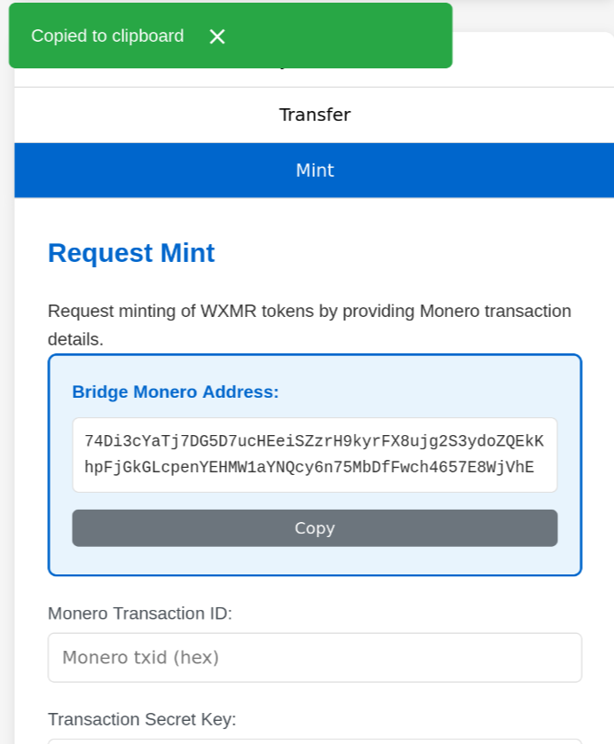
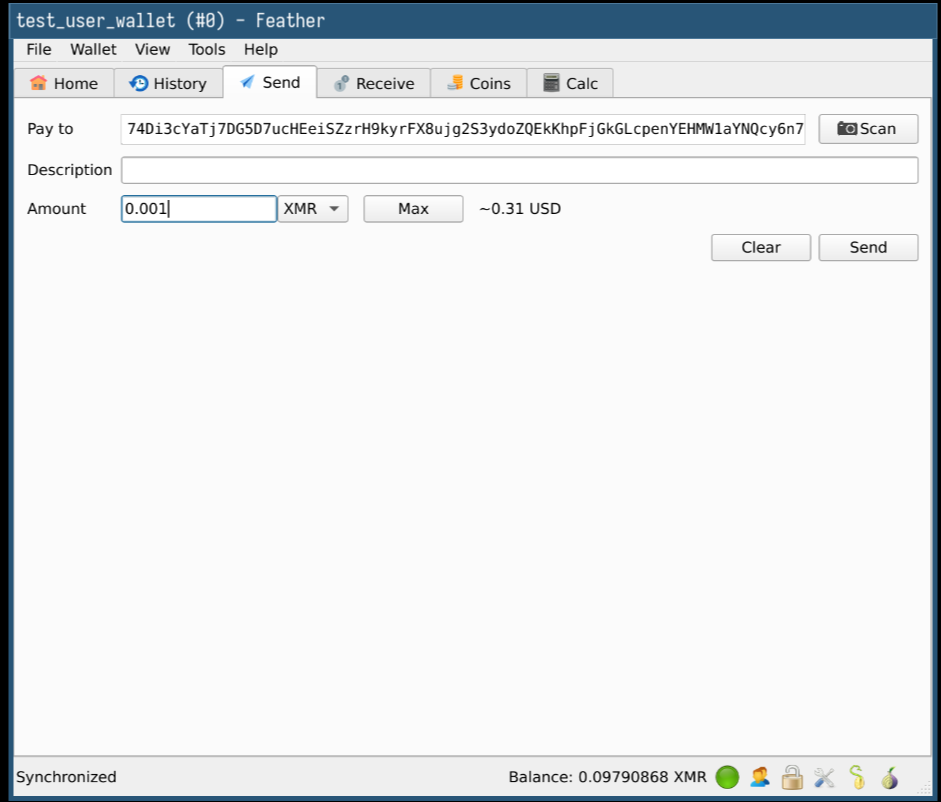
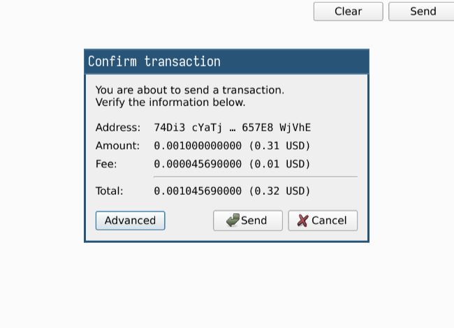
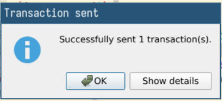
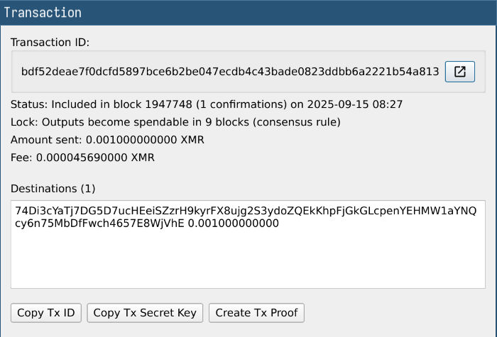
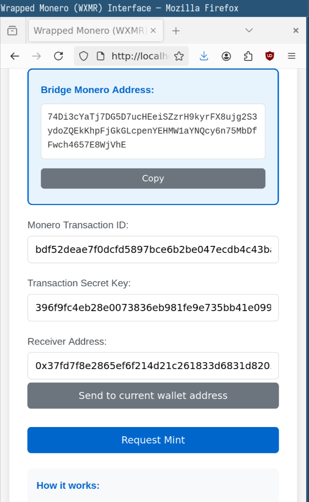
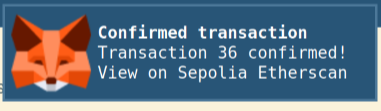
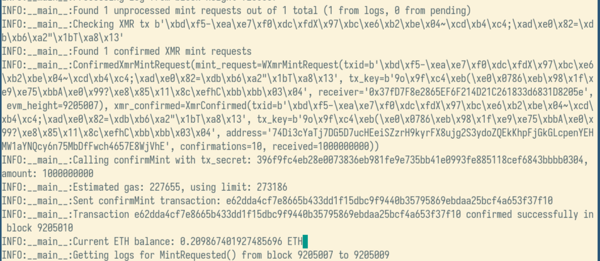

# Wrapped Monero (WXMR)

A privacy-focused bridge between Monero (XMR) and Ethereum, featuring encrypted balances using Fhenix's Fully Homomorphic Encryption (FHE).

**Note**: This is a demo for a very complex application. We have developed
Wrapped Monero
for evaluation on the Monero stagenet and the Ethereum Sepolia testnet. Please
do not use any sensitive private keys or other confidential data with this
application.

## Overview

WXMR (Wrapped Monero) is a privacy-preserving ERC20 token that represents Monero on Ethereum. Key features:

- **Encrypted Balances**: All token balances are encrypted using Fhenix FHE, ensuring privacy on-chain
- **Trustless Bridge**: Two-step minting process with cryptographic verification of Monero transactions
- **User-Friendly Interface**: Modern web interface for interacting with the WXMR token

## Architecture

The system consists of three main components:

1. **Smart Contract** (`contract/wxMR.sol`)
   - ERC20-compatible token with encrypted balances
   - Two-step minting process for bridging XMR
   - Authority-controlled minting and burning
   - FHE-powered private transfers

2. **Bridge Service** (`bridge/`)
   - Monitors Monero network for incoming transactions
   - Verifies XMR deposits using transaction keys
   - Automatically mints WXMR tokens upon confirmation
   - Python-based service using Monero RPC

3. **Frontend** (`frontend/`)
   - Web interface for token operations
   - MetaMask integration
   - Transfer, mint, and burn functionality
   - Real-time balance updates

## Deployed Contract Address
[0x25305b62299562197582eB87443B64B894685Fb4](https://sepolia.etherscan.io/address/0x25305b62299562197582eB87443B64B894685Fb4)

## Validator Directory (Cryplography Infrastructure)

### Overview
The `validator/` directory contains the TSS (Threshold Signature Scheme) infrastructure for implementing secure cryptographic operations across a distributed network. This enables threshold signatures and live blockchain transaction execution for the WXMR bridge.

### Directory Structure
```
validator/
├── validator-tss                  # Compiled TSS validator binary
├── configs/validator{0-6}.toml    # Individual validator configurations
├── keys/                          # DKG-generated key shares
│   ├── 0/keys_0_1.json           # Validator 0 key share
│   ├── 1/keys_1_2.json           # Validator 1 key share
│   └── ... through validator 6
├── scripts/
│   ├── run_validators.sh         # Start 7-validator network
│   ├── check_status.sh          # Monitor network status
│   └── start_dkg_ceremony.sh    # Run distributed key generation
├── submit_tss_confirm_mint.py    # Transaction submission
├── requirements.txt              # Python dependencies
├── SETUP.md                     # Comprehensive setup guide
└── env.py                      # Environment configuration
```

### Key Components

#### 1. TSS Authority Address
**`0x0ab60f2164615B720C38c6656Eb0420D718dfef6`** - Generated via DKG ceremony

#### 2. Validator Network
- **7 validators** (indices 0-6)
- **4/7 threshold** for consensus
- **Ports 8001-8007** respectively
- **Sepolia RPC** integration

#### 3. Core Files and Scripts

**`run_validators.sh`** - One-command network start:
```bash
./run_validators.sh
```

**`submit_tss_confirm_mint.py`** - Transaction submission:
```bash
python3 submit_tss_confirm_mint.py --secret 0x123... --amount 1.5
```

**`check_status.sh`** - Network monitoring:
```bash
./check_status.sh
```

#### 4. Configuration
Each validator uses individual `.toml` files for:
- Network binding (ports 8001-8007)
- Monero RPC connectivity
- Ethereum Sepolia RPC setup
- MPC parameters (4/7 threshold)
- Key share paths

#### 5. Cryptographic Setup
- **Distributed Key Generation (DKG)** for shared secrets
- **Threshold signatures** (TSS) for transaction authorization
- **Ethereum addresses** derived from combined public keys
- **Monero addresses** with proper derivation

### Quick Start Commands

```bash
# 1. Build validator
cd validator
cargo build --release

# 2. Start the network
./run_validators.sh

# 3. Monitor status
./check_status.sh

# 4. Submit test transaction
python3 submit_tss_confirm_mint.py --secret 0xeeee... --amount 1.5

# 5. Check logs
tail -f logs/validator-0.log
```

### Demo Flow
1. **Launch**: Run 7 validators on ports 8001-8007
2. **Monitor**: Check network health with status script
3. **Transact**: Submit transactions via Python script
4. **Verify**: Confirmed transactions on Sepolia testnet

### Security Features
- Private keys never leave validator nodes
- 4-of-7 consensus required for signatures
- Deterministic key derivation
- Secure RPC connections

## Usage

### How to demo

Here's how to **set up** everything

1. Install dependencies for bridge by running `uv sync` inside
   the `bridge/` directory.
2. Install dependencies for the frontend by running `npm i` inside
   the `frontend/` directory.
3. Install the Monero CLI tools and make sure that you have the
   `monero-wallet-rpc` program available in your terminal.
4. Create a Monero wallet that receives the XMR to be wrapped and make sure
   that it's available in a directory that `monero-wallet-rpc` can access.

Here's how to **start up** everything

1. Start the Monero wallet RPC endpoint by running `bridge/bin/monero-cli`.
2. Start the bridge program by running `uv run ./main.py` inside the `bridge/` directory.
3. Start the frontend by running `npm run dev` inside the `frontend/`
   directory.

Here's how to make a demo transaction

1. Open the frontend on <http://localhost:5173>
2. Press on the **Transfer** button
3. Press the **Copy** button under *Bridge Monero Address*

4. In your Monero wallet, paste the *Bridge Monero Address* and send an arbitrary amount of XMR to this *Bridge Monero
   address*. The screenshot shows how it looks in **Feather** wallet

5. Initiate the transaction. The screenshot shows how it looks in
   **Feather wallet** after you press the **Send** button.

6. Confirm the transaction and review the transaction details. The following screenshots show the confirmation notice after
   pressing **Send** inside the *Confirm transaction* dialog and then
   selecting **Show details**.


7. Now copy the **Tx ID** and **Tx Secret Key** into the Monero Bridge website.
   The **Transaction** details screen has two buttons **Copy Tx ID** and **Copy
   TX Secret Key**. Press each button and then go to the matching fields
   **Monero Transaction ID** and **Transaction Secret Key** and paste the
   values there.

8. To receive the Wrapped Monero yourself, you can press the **Send to current
   wallet address** button. If you want to mint the Wrapped Monero for someone
   else, you can enter their wallet address as well.
9. Press the **Request Mint** button. Your wallet provider then asks you to
   confirm the transaction. The screenshot shows Metamask's **Transaction
   request** screen. Press **Confirm**. Metamask shows a **Confirmed transaction**
   after some time.

10. You have now requested a mint. The bridge searches for your mint request
    and gives you Wrapped Monero.


Here's what the bridge outputs when it mints Wrapped Monero:

```
INFO:__main__:Getting logs for MintRequested() from block 9205006 to 9205007
INFO:__main__:Retrieved 1 logs
INFO:__main__:Processing log from block height 9205007
INFO:__main__:Found 1 unprocessed mint requests out of 1 total (1 from logs, 0 from pending)
INFO:__main__:Checking XMR tx b'\xbd\xf5-\xea\xe7\xf0\xdc\xfdX\x97\xbc\xe6\xb2\xbe\x04~\xcd\xb4\xc4;\xad\xe0\x82=\xdb\xb6\xa2"\x1bT\xa8\x13'
INFO:__main__:Found 1 confirmed XMR mint requests
INFO:__main__:ConfirmedXmrMintRequest(mint_request=WXmrMintRequest(txid=b'\xbd\xf5-\xea\xe7\xf0\xdc\xfdX\x97\xbc\xe6\xb2\xbe\x04~\xcd\xb4\xc4;\xad\xe0\x82=\xdb\xb6\xa2"\x1bT\xa8\x13', tx_key=b'9o\x9f\xc4\xeb(\xe0\x0786\xeb\x98\x1f\xe9\xe75\xbbA\xe0\x99?\xe8\x85\x11\x8c\xefhC\xbb\xbb\x03\x04', receiver='0x37fD7F8e2865EF6F214D21C261833d6831D8205e', evm_height=9205007), xmr_confirmed=XmrConfirmed(txid=b'\xbd\xf5-\xea\xe7\xf0\xdc\xfdX\x97\xbc\xe6\xb2\xbe\x04~\xcd\xb4\xc4;\xad\xe0\x82=\xdb\xb6\xa2"\x1bT\xa8\x13', tx_key=b'9o\x9f\xc4\xeb(\xe0\x0786\xeb\x98\x1f\xe9\xe75\xbbA\xe0\x99?\xe8\x85\x11\x8c\xefhC\xbb\xbb\x03\x04', address='74Di3cYaTj7DG5D7ucHEeiSZzrH9kyrFX8ujg2S3ydoZQEkKhpFjGkGLcpenYEHMW1aYNQcy6n75MbDfFwch4657E8WjVhE', confirmations=10, received=1000000000))
INFO:__main__:Calling confirmMint with tx_secret: 396f9fc4eb28e0073836eb981fe9e735bb41e0993fe885118cef6843bbbb0304, amount: 1000000000
INFO:__main__:Estimated gas: 227655, using limit: 273186
INFO:__main__:Sent confirmMint transaction: e62dda4cf7e8665b433dd1f15dbc9f9440b35795869ebdaa25bcf4a653f37f10
INFO:__main__:Transaction e62dda4cf7e8665b433dd1f15dbc9f9440b35795869ebdaa25bcf4a653f37f10 confirmed successfully in block 9205010
INFO:__main__:Current ETH balance: 0.209867401927485696 ETH
```


### Wrapping XMR to WXMR

1. Send XMR to the bridge's Monero address
2. Call `requestMint()` with the transaction details
3. Wait for the bridge to verify and confirm the mint
4. Receive encrypted WXMR tokens

### Transferring WXMR

1. Connect MetaMask to the dApp
2. Enter recipient's address and amount
3. Submit the transfer transaction
4. Transaction is processed with encrypted balances

### Unwrapping WXMR to XMR

1. Access the admin interface
2. Initiate a burn request with your Monero address
3. Wait for the authority to process the burn
4. Receive XMR at your specified address

## Security Features

- Encrypted balances using Fhenix FHE
- Two-step minting process with cryptographic verification
- Authority-controlled bridge operations
- Monero transaction key verification
- Multisig support for administrative functions


## License

MIT License

## Contributing

1. Fork the repository
2. Create your feature branch
3. Commit your changes
4. Push to the branch
5. Open a pull request
