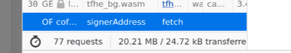
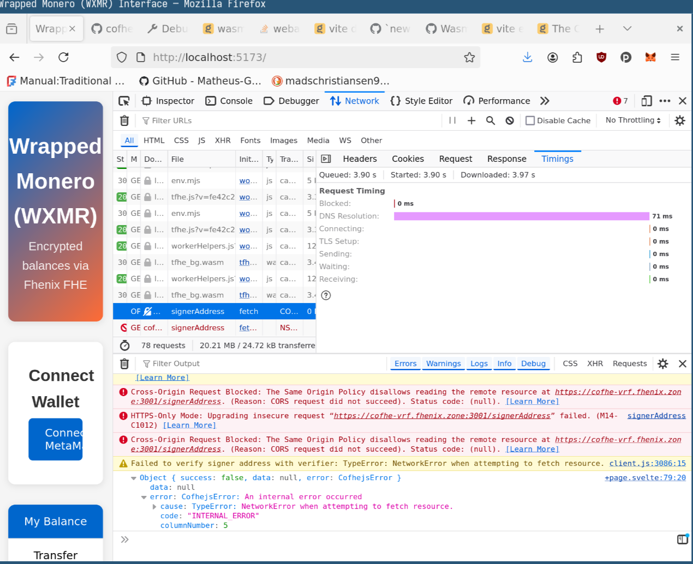

# Wrapped Monero Frontend

Here's how to install the dependencies and run a development version of the
Wrapped Monero Frontend

```bash
npm install
npm run dev
```

Open at

<http://localhost:5173>




